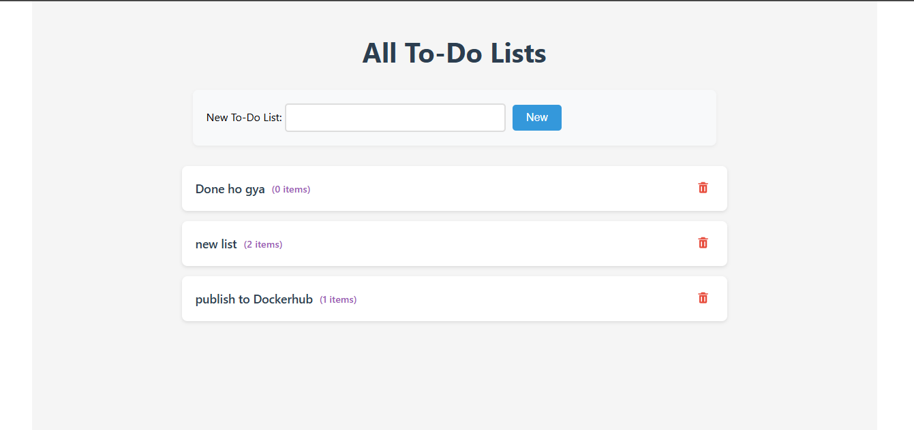
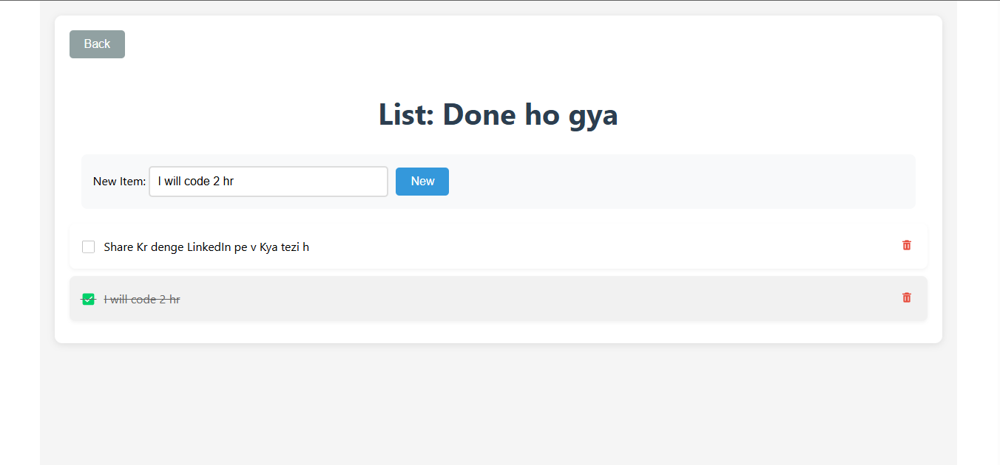

# FARM Stack Todo Application

A modern, full-stack todo list application built with the FARM (FastAPI, React, MongoDB) stack.

## 🚀 Technology Stack

### Backend Stack

- **FastAPI** (v0.115.11)

  - High-performance Python web framework
  - Built-in OpenAPI (Swagger) documentation
  - Asynchronous request handling
  - Type hints and data validation with Pydantic
  - CORS middleware for cross-origin requests

- **MongoDB**

  - Document-based NoSQL database
  - MongoDB Atlas cloud hosting
  - Asynchronous operations with Motor (v3.7.0)
  - ODM (Object Document Mapping) with Beanie

- **Python Libraries**
  - motor: Async MongoDB driver
  - pydantic: Data validation
  - uvicorn: ASGI server
  - python-dotenv: Environment variable management

### Frontend Stack

- **React** (v19.0.0)

  - Functional components
  - React Hooks (useState, useEffect, useRef)
  - Custom components for list management

- **Vite** (v6.2.0)

  - Modern build tool
  - Hot Module Replacement (HMR)
  - Dev server with proxy configuration
  - ESBuild-powered builds

- **Styling**

  - Modern CSS3
  - Responsive design
  - Flexbox layouts
  - CSS transitions and animations
  - Mobile-first approach

- **HTTP Client**
  - Axios for API communication
  - RESTful API integration

### DevOps & Infrastructure

- **Docker**

  - Multi-container setup
  - Docker Compose orchestration
  - Volume management
  - Network isolation

- **Nginx**
  - Reverse proxy
  - Static file serving
  - API routing
  - WebSocket support

## 🏗 Architecture

### Container Architecture

```
┌─────────────┐     ┌──────────────┐     ┌─────────────┐
│    Nginx    │ --> │   Frontend   │     │   MongoDB   │
│  (Port 80)  │     │  (Port 5173) │     │   Atlas     │
└─────────────┘     └──────▲───────┘     └───▲─────────┘
       │                   │                 |
       │           ┌───────▼──────┐          │
       └─────────> │   Backend    │──────────┘
                   │  (Port 3001) │
                   └──────────────┘
```

### API Endpoints

```
GET    /api/lists                          # Get all todo lists
POST   /api/lists                          # Create new list
GET    /api/lists/{list_id}               # Get specific list
DELETE /api/lists/{list_id}               # Delete list
POST   /api/lists/{list_id}/items         # Add item to list
DELETE /api/lists/{list_id}/items/{id}    # Delete item
PATCH  /api/lists/{list_id}/checked_state # Toggle item state
```

## 🔧 Technical Details

### Backend Implementation

- Asynchronous database operations
- Data Access Layer (DAL) pattern
- Pydantic models for validation
- CORS middleware configuration
- Environment variable management
- Error handling and status codes

### Frontend Implementation

- Component-based architecture
- State management with hooks
- Real-time updates
- Error handling
- Loading states
- Mobile-responsive design
- Icon integration (react-icons)

### Database Schema

```javascript
TodoList {
  _id: ObjectId
  name: string
  items: [
    {
      id: string (UUID)
      label: string
      checked: boolean
    }
  ]
}
```

### Security Features

- CORS protection
- Environment variable usage
- Secure MongoDB connection
- Input validation
- Error handling

## 🚀 Development Features

### Hot Reload Support

- Backend: Uvicorn with --reload
- Frontend: Vite HMR
- Volume mounting for development

### Docker Configuration

- Multi-stage builds
- Development-optimized setup
- Volume mapping
- Network isolation
- Environment variable handling

### Code Quality

- ESLint configuration
- Python type hints
- Structured project layout
- Modular component design

## 📦 Project Structure

```
farm-stack-todo/
├── backend/
│   ├── src/
│   │   ├── server.py    # FastAPI application
│   │   └── dal.py       # Data Access Layer
│   ├── Dockerfile
│   └── requirements.txt
├── frontend/
│   ├── src/
│   │   ├── components/
│   │   ├── App.jsx
│   │   └── main.jsx
│   ├── Dockerfile
│   └── package.json
├── nginx/
│   └── nginx.conf
├── compose.yaml
└── .env
```

## 🔧 Environment Configuration

- MongoDB connection string
- Debug mode settings
- Port configurations
- CORS settings
- Development/Production modes

## 🌟 Features

- Create multiple todo lists
- Add/remove items
- Check/uncheck items
- Real-time updates
- Responsive design
- Cross-browser support
- Mobile-friendly interface

## 🔒 Best Practices

- Clean code architecture
- Separation of concerns
- RESTful API design
- Error handling
- Type safety
- Responsive design patterns
- Docker best practices
- Security considerations

## Screenshots



## 📫 Let's Connect

- GitHub: [SuhelKhanCA](https://github.com/SuhelKhanCA)
- LinkedIn: [Suhel Khan](https://www.linkedin.com/in/suhelkhanska/)
- Twitter: [Suhel Khan](https://twitter.com/@suhelkhanalig)
- Email: suhelkhanca@gmail.com